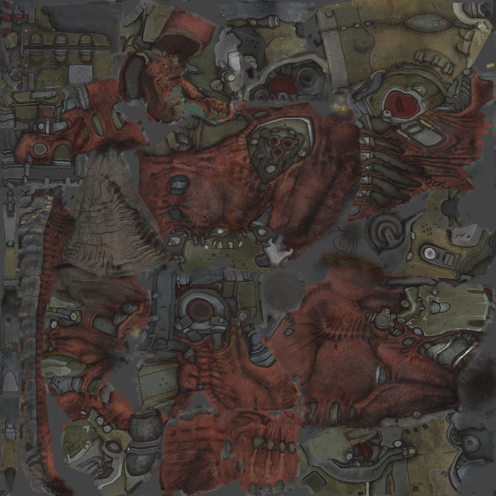

# MD5Viewer

OpenGL-based Doom 3 MD5 mesh and animation viewer written in C# with OpenTK and Windows Forms.

The repository includes a Cyberdemon MD5 mesh, textures, and animations so the viewer can be built and run without additional setup.



## Features

- Doom 3 MD5 mesh and animation loading
- Skeletal animation with interpolated joint poses
- Bind-pose normal and tangent-space skinning
- Diffuse, normal, and RGB specular map rendering
- sRGB-aware diffuse texture sampling
- Back-face culling and winding diagnostics
- Multiple diagnostic render modes
- Animation selection, playback, and timeline scrubbing

## Requirements

- Windows
- .NET 10 SDK
- OpenGL 3.3-compatible graphics driver

## Build and run

```powershell
dotnet restore source/MD5Viewer.sln
dotnet run --project source/MD5Viewer/MD5Viewer.csproj
```

Release build:

```powershell
dotnet build source/MD5Viewer.sln -c Release
```

The project copies the contents of `cyberdemon/` into the application's `Assets` output directory automatically.

## Controls

| Input | Action |
| --- | --- |
| Left mouse drag | Orbit camera |
| Right mouse drag | Pan camera |
| Mouse wheel | Zoom |
| Right mouse double-click | Reset camera |
| `N` | Toggle normal-map Y direction |
| `F` | Toggle front-face winding |

The render-mode selector provides full rendering, points, wireframe, texture, lighting, normal-map, specular-map, bump-map, and TBN diagnostic views.

## Project layout

- `source/MD5Viewer.sln`: Visual Studio solution
- `source/MD5Viewer/`: viewer source code
- `cyberdemon/`: bundled MD5 mesh, animations, and texture assets

## Asset notice

The bundled Cyberdemon and Doom 3-related assets are included for educational and technical demonstration purposes. Doom 3 and its assets are property of their respective copyright holders. Review the applicable asset license and distribution rights before redistributing or using them commercially.

